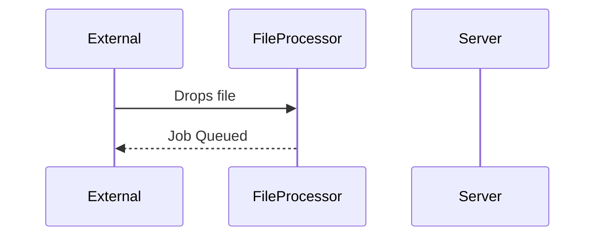
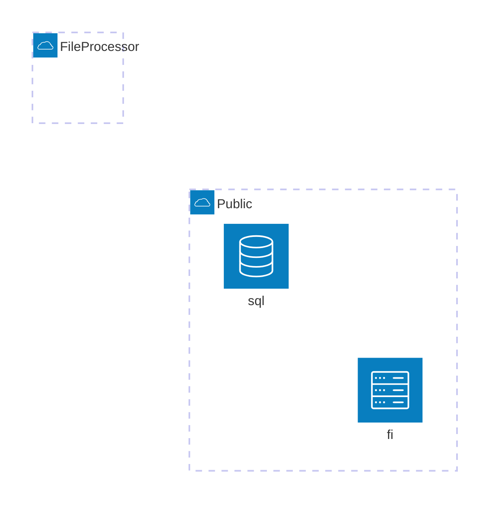

User->>Browser: Open website
    Browser->>Server: Request page
    Server-->>Browser: Send HTML/CSS/JS
    Browser-->>User: Render page
    User->>Browser: Interact with page
    Browser->>Server: Send data
    Server-->>Browser: Acknowledge data
    Browser-->>User: Update UI

1. File dropped into blob storage
2. Event Grid trigger fireds - on new file for processing
3. File queued - current impl. seems to group file parts internally onto concurrent queue, then push batches to Azure Queue
4. Azure Queued function(s) process tha batches
5. Batches put records into SQL Server
6. Some parts of the process require further database operations and things to have completed first.

## ? Consideration:
- Inititial processing job completes async and returns a job ID - who monitors this?
- Break sequential process into async steps and enqueue a subsequent task on the queue.
- Determine when the job has been completed (ie all records processed)
  - Is is enough to know that first SQL taks was started? What's the consequence of doing that step again?
  - 