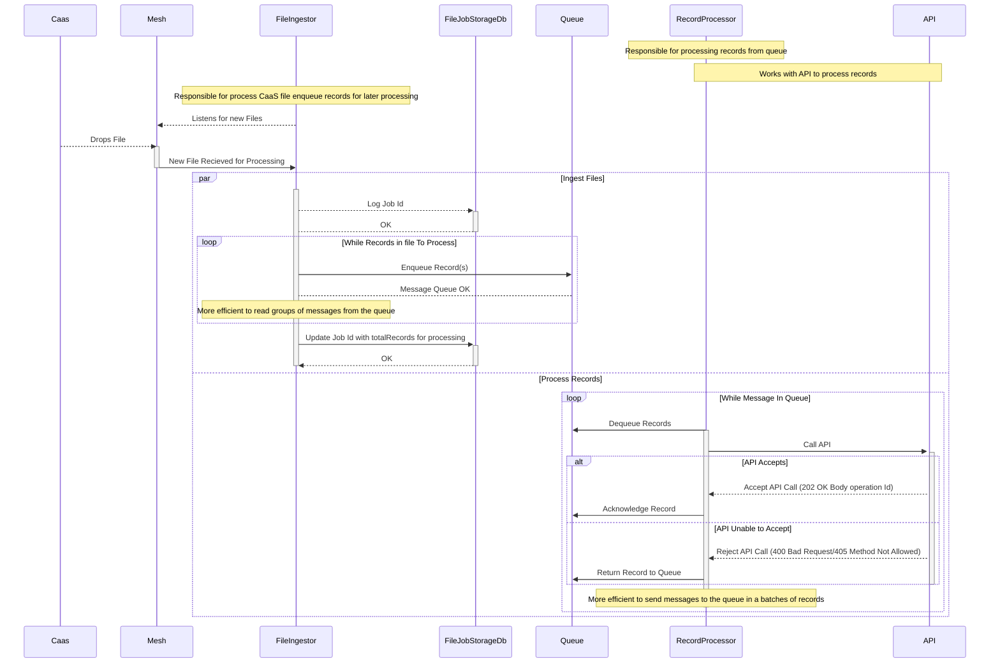

```mermaid
sequenceDiagram
    participant Caas
    participant Mesh    
    participant FileIngestor
    participant FileJobStorageDb
    participant Queue
    participant RecordProcessor
    
    
    note over RecordProcessor: Responsible for processing records from queue
    note over RecordProcessor, API: Works with API to process records

    note over FileIngestor: Responsible for process CaaS file enqueue records for later processing
            
    FileIngestor-->>Mesh: Listens for new Files    
    Caas-->>Mesh: Drops File
    activate Mesh
    Mesh->>FileIngestor: New File Recieved for Processing
    deactivate Mesh
    par Ingest Files 
        activate FileIngestor

        FileIngestor-->>+FileJobStorageDb: Log Job Id
        FileJobStorageDb-->-FileIngestor: OK
    
        loop While Records in file To Process                            
            FileIngestor->>Queue: Enqueue Record(s)                     
                Queue-->FileIngestor: Message Queue OK            
            Note over FileIngestor: More efficient to read groups of messages from the queue
        end

        FileIngestor->>+FileJobStorageDb: Update Job Id with totalRecords for processing
        FileJobStorageDb-->>-FileIngestor: OK

        deactivate FileIngestor        
    and Process Records
        
            loop While Message In Queue                            
                RecordProcessor->>Queue: Dequeue Records          
                activate RecordProcessor                          
                activate API
                RecordProcessor->>+API: Call API
                alt API Accepts
                    API-->>RecordProcessor: Accept API Call (202 OK Body operation Id)
                    RecordProcessor->>Queue: Acknowledge Record                    
                else API Unable to Accept
                    API-->>RecordProcessor: Reject API Call (400 Bad Request/405 Method Not Allowed)
                    RecordProcessor->>Queue: Return Record to Queue
                    
                end
                deactivate API            
                Note over RecordProcessor: More efficient to send messages to the queue in a batches of records
                deactivate RecordProcessor
            end       
    end     
```

