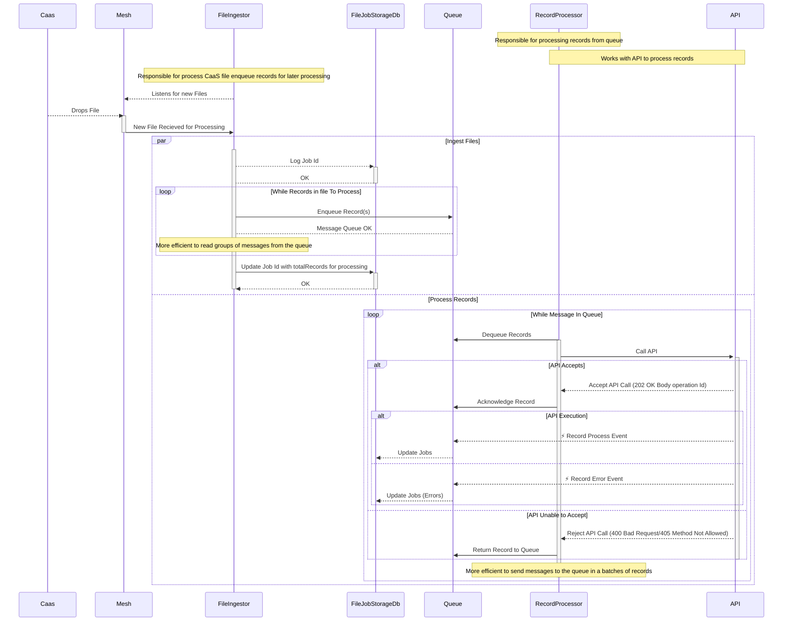

# Technical Discussion Points

Consider using an Azure Service Bus over Azure Storage Queues. The key benefits are implementation of an enterprise scale pub/sub model and support for topics. Each subscription gets it's own copy of the message. By decoupling the `Messages` sent to Topics from the Subscribers the system remains flexible to send events to interested parts of the system. By design, if there are no subscriptions to a topic the messages are not persisted on the queue.

Key points and observations
- Messages for the RecordProcessor are queued to a `Records` Topic. 
- A `RecordProcessor` subscription listens to the `Records` topic; multiple listeners on the `RecordProcessor` subscription enable scale out if needed
    - There are flexible options. In the simplest form, the RecordProcessor limits the speed by controlling the *rate* of how quickly it will pull messages freom the queue.
- The RecordProcessor calls the `API` to process a record.
- The API implementation is opaque to the RecordProcessor allowing the API to be redesigned, optimised or evolve without changes to to the bulk upload solution.
    - It's recommend that the API leverages queues/topics to further implement scale-out and rate limiting to ensuring performance and reliability objectives of the solution.
    - API should emit Events pushlished to the Azure Service Bus on a separate Topic, for example an `ApiEvents` Topic. Applications can subscribe to ApiEvents and optionally filter for interested events.

## Example High Level Flow

